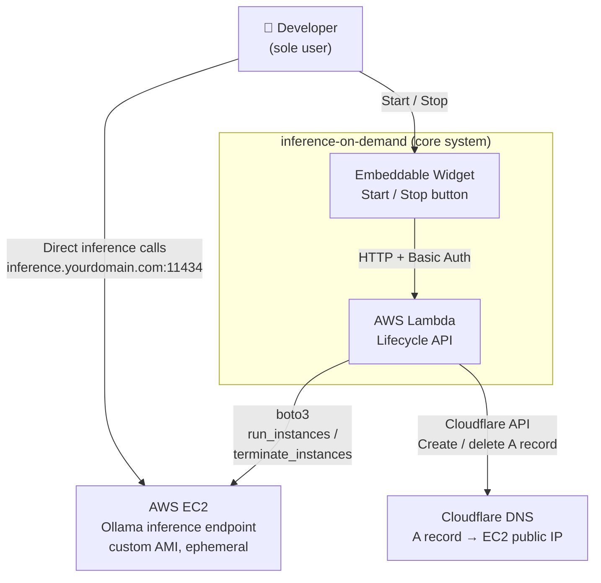

# C1 — System Context

## Notes

- Inference traffic goes directly from the browser to EC2 — Lambda is never in the inference path (avoids 15-min timeout limitation)
- Lambda manages EC2 lifecycle via boto3 and DNS via Cloudflare API directly — no Terraform at runtime
- EC2 is terminated (not stopped) on every session end — every session starts from a clean AMI
- No Elastic IP — Cloudflare A record is created on start with the new public IP and deleted on stop (TTL = 60s)
- Terraform Cloud is used only for persistent infra (`deploy/aws/`) — not involved at runtime