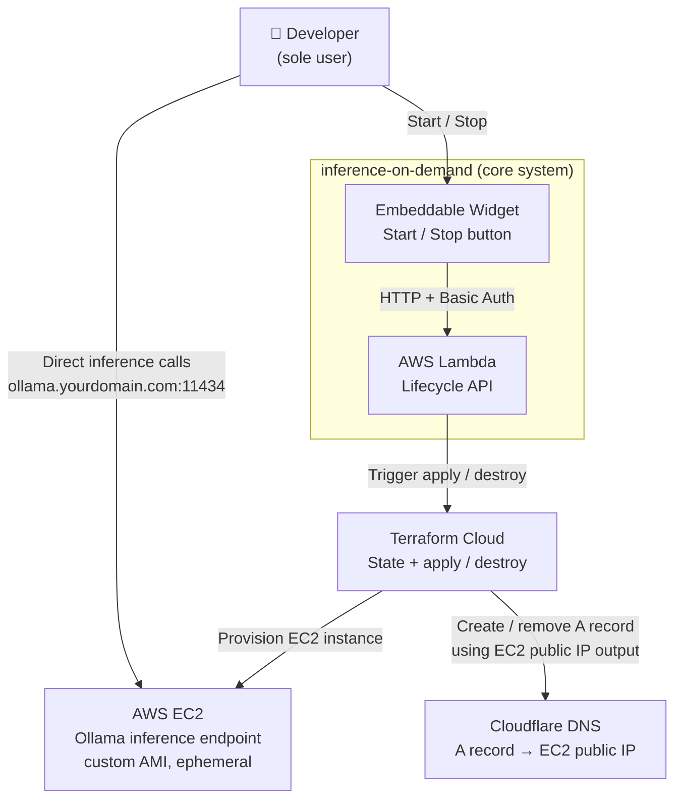

# C1 — System Context

## Notes

- Inference traffic goes directly from the browser to EC2 — Lambda is not in the inference path (avoids 15-min timeout limitation)
- Cloudflare DNS is managed entirely by Terraform Cloud using `aws_instance.ollama.public_ip` as input — EC2 has no direct relationship with Cloudflare
- EC2 is terminated (not stopped) on destroy — every session starts from a clean AMI
- No Elastic IP — the A record is recreated on every `terraform apply` with the new public IP (TTL = 60s)
