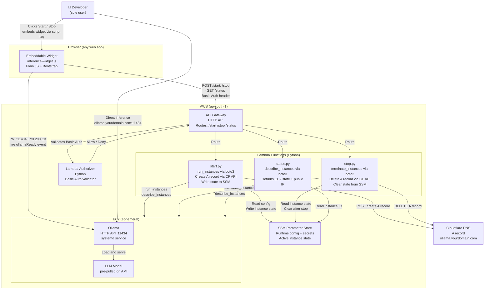

# C2 — Container Diagram

## Container responsibilities

| Container | Technology | Responsibility |
|---|---|---|
| Embeddable widget | Plain JS + Bootstrap | Renders Start/Stop button, polls status, fires `ollamaReady` / `ollamaOffline` events |
| API Gateway | AWS HTTP API | Routes lifecycle calls, enforces auth via Lambda Authorizer |
| Lambda Authorizer | Python | Validates Basic Auth header against credentials in SSM |
| start.py | Python / Lambda | Reads config from SSM, calls `run_instances`, creates Cloudflare A record, writes instance state to SSM |
| stop.py | Python / Lambda | Reads instance state from SSM, deletes Cloudflare A record, calls `terminate_instances`, clears SSM state |
| status.py | Python / Lambda | Reads instance ID from SSM, calls `describe_instances`, returns current state and public IP |
| SSM Parameter Store | AWS SSM | Stores all runtime config, secrets, and active instance state (`instance_id`, `dns_record_id`) |
| EC2 instance | Amazon Linux 2023 | Runs Ollama as a systemd service, serves inference on :11434 |
| Ollama | Ollama runtime | Loads pre-pulled model, exposes HTTP API |
| Cloudflare DNS | Cloudflare | Resolves `ollama.yourdomain.com` to EC2 public IP (TTL 60s) |

## Notes

- **No Terraform at runtime** — EC2 and DNS are managed directly by Lambda via boto3 and Cloudflare API. Terraform is only used for persistent infra (`infra/`), applied once.
- **SSM is the runtime state store** — `start.py` writes `instance_id` and `dns_record_id` to SSM; `stop.py` reads and clears them. No external database needed.
- **Inference is always direct** — the browser calls Ollama at `ollama.yourdomain.com:11434`. Lambda is never in the inference path.
- **Two-stage polling** — the widget first polls `/status` (EC2 state via `describe_instances`), then polls Ollama directly on `:11434`. These are separate checks — EC2 running does not mean Ollama is ready.
- **Stop is fast** — terminating an instance and deleting a DNS record via API calls takes ~10-30 seconds, vs 2-3 minutes for a Terraform destroy run.