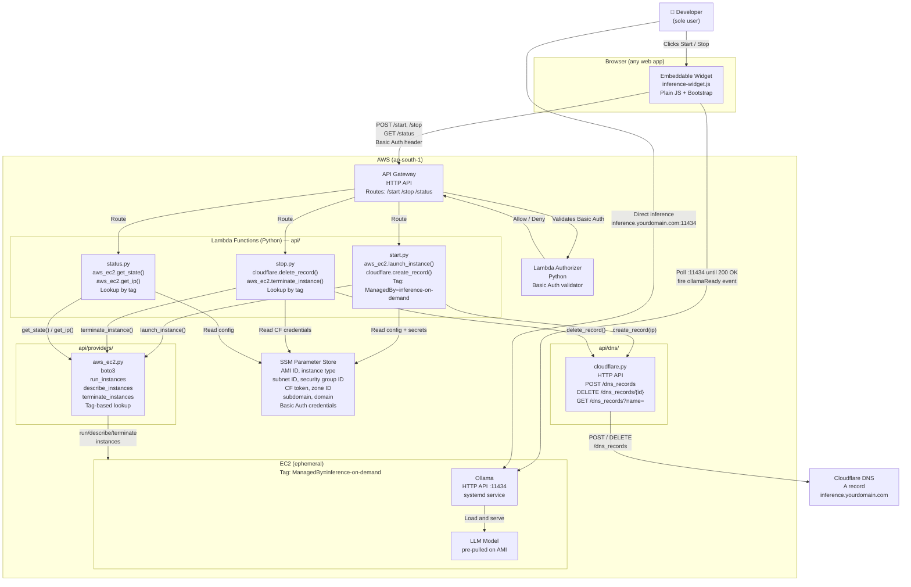

# C2 — Container Diagram

## Container Responsibilities

| Container | Technology | Responsibility |
|---|---|---|
| Embeddable widget | Plain JS + Bootstrap | Renders Start/Stop UI, polls status, fires `ollamaReady` / `ollamaOffline` events |
| API Gateway | AWS HTTP API | Routes lifecycle calls, enforces auth via Lambda Authorizer |
| Lambda Authorizer | Python | Validates Basic Auth header against credentials in SSM |
| start.py | Python / Lambda | Reads config from SSM, calls `aws_ec2.launch_instance()`, calls `cloudflare.create_record()` |
| stop.py | Python / Lambda | Reads CF credentials from SSM, calls `cloudflare.delete_record()`, calls `aws_ec2.terminate_instance()` |
| status.py | Python / Lambda | Calls `aws_ec2.get_state()` and `aws_ec2.get_ip()` by tag lookup, returns state to widget |
| aws_ec2.py | Python / boto3 | Implements `ComputeProvider` — wraps `run_instances`, `describe_instances`, `terminate_instances` |
| cloudflare.py | Python / requests | Implements `DNSProvider` — wraps Cloudflare HTTP API for create/delete/lookup |
| SSM Parameter Store | AWS SSM | Stores all config and secrets — read by Lambda at runtime, never written at runtime |
| EC2 instance | Amazon Linux 2023 | Runs Ollama as a systemd service, tagged `ManagedBy=inference-on-demand` |
| Ollama | Ollama runtime | Loads pre-pulled model, exposes HTTP API on :11434 |
| Cloudflare DNS | Cloudflare | Resolves `inference.yourdomain.com` to EC2 public IP (TTL 60s) |

## Notes

- **No runtime state in SSM** — EC2 instances are found by tag `ManagedBy=inference-on-demand`. Cloudflare records are found by querying the subdomain name. Nothing is written to SSM between sessions.
- **Provider abstraction** — `start.py`, `stop.py`, `status.py` call `aws_ec2.py` and `cloudflare.py` through the `ComputeProvider` and `DNSProvider` interfaces. See `architecture/provider-architecture.md` to add other providers.
- **Inference is always direct** — the browser calls Ollama at `inference.yourdomain.com:11434`. Lambda is never in the inference path.
- **Two-stage polling** — widget polls `/status` (EC2 state) then polls Ollama directly on `:11434`. EC2 `running` ≠ Ollama ready (~30–60s gap while model loads).