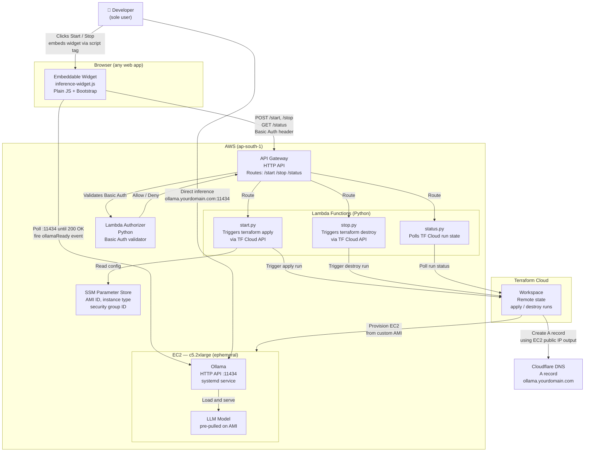

# C2 — Container Diagram

## Container responsibilities

| Container | Technology | Responsibility |
|---|---|---|
| Embeddable widget | Plain JS + Bootstrap | Renders Start/Stop button, polls status, fires `ollamaReady` event |
| API Gateway | AWS HTTP API | Routes lifecycle calls, enforces auth via Lambda Authorizer |
| Lambda Authorizer | Python | Validates Basic Auth header against credentials in environment |
| start.py | Python / Lambda | Reads config from SSM, triggers `terraform apply` via TF Cloud API |
| stop.py | Python / Lambda | Triggers `terraform destroy` via TF Cloud API |
| status.py | Python / Lambda | Polls Terraform Cloud run status, returns state to widget |
| SSM Parameter Store | AWS SSM | Stores AMI ID, instance type, security group ID — read by Lambda at runtime |
| Terraform Cloud workspace | Terraform | Holds remote state, executes apply/destroy, provisions EC2 + Cloudflare record |
| EC2 instance | Amazon Linux 2023 | Runs Ollama as a systemd service, serves inference on :11434 |
| Ollama | Ollama runtime | Loads pre-pulled model, exposes OpenAI-compatible HTTP API |
| Cloudflare DNS | Cloudflare | Resolves `ollama.yourdomain.com` to EC2 public IP (TTL 60s) |

## Notes

- API Gateway and all Lambda functions are **persistent** — provisioned once via `terraform apply` in `infra/`
- EC2 and the Cloudflare A record are **ephemeral** — created and destroyed per session by the Terraform Cloud workspace
- The widget polls Ollama directly on `:11434` to detect readiness — Lambda is not in the health-check path
- SSM Parameter Store decouples AMI ID from Lambda code — update the AMI without redeploying Lambda
- Security Group restricts port 11434 to the developer's IP only — Ollama has no application-level auth
