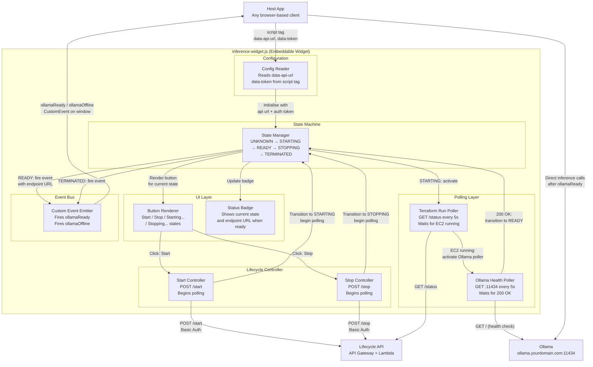

# C3 — Component Diagram: inference-widget.js

## Component responsibilities

| Component | Responsibility |
|---|---|
| Config Reader | Reads `data-api-url` and `data-token` from the `<script>` tag attributes at initialisation |
| State Manager | Single source of truth for widget state — all transitions go through here |
| Button Renderer | Renders the correct button label and enabled/disabled state for each state machine state |
| Status Badge | Displays current state and, when READY, the active endpoint URL |
| Start Controller | Calls `POST /start`, handles errors, instructs State Manager to transition to STARTING |
| Stop Controller | Calls `POST /stop`, handles errors, instructs State Manager to transition to STOPPING |
| Terraform Run Poller | Polls `GET /status` every 5s while STARTING — waits for EC2 to reach `running` state |
| Ollama Health Poller | Polls `GET :11434` every 5s after EC2 is running — waits for Ollama to respond 200 OK |
| Custom Event Emitter | Fires `ollamaReady` (with endpoint URL) and `ollamaOffline` on `window` for host app to consume |

## State machine transitions

| From | Event | To |
|---|---|---|
| UNKNOWN | Widget initialises, `/status` returns no active run | TERMINATED |
| UNKNOWN | Widget initialises, `/status` returns active run + EC2 running | READY |
| TERMINATED | User clicks Start | STARTING |
| STARTING | Ollama returns 200 OK | READY |
| READY | User clicks Stop | STOPPING |
| STOPPING | Terraform destroy completes | TERMINATED |

## Notes

- Two-stage polling is intentional: Terraform Run Poller and Ollama Health Poller are separate concerns — EC2 `running` in AWS does not mean Ollama is ready to serve
- The widget fires events on `window` so host apps need zero knowledge of the widget internals — they only listen for `ollamaReady`
- All API calls include `Authorization: Basic <token>` derived from `data-token` attribute
- The widget is self-contained — no framework dependencies, no build step required
EOF