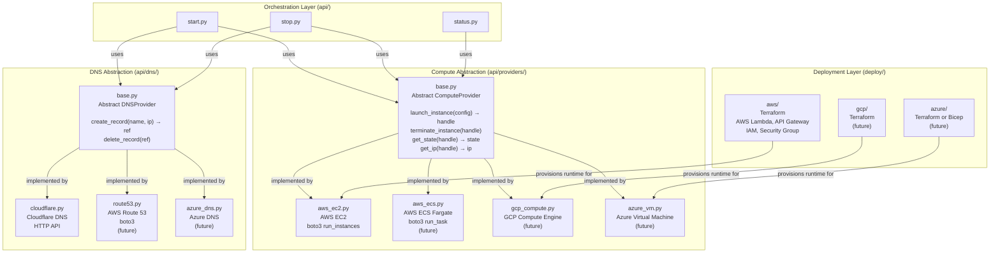

# Provider Architecture

This diagram shows the abstraction layers that make `inference-on-demand` portable across cloud providers, compute types, and DNS services.

## How to Add a New Compute Provider

1. Create `api/providers/<your_provider>.py`
2. Extend `ComputeProvider` from `api/providers/base.py`
3. Implement all four methods: `launch_instance`, `terminate_instance`, `get_state`, `get_ip`
4. Add your provider to the factory in `api/providers/__init__.py`
5. Create `deploy/<your_cloud>/` with the corresponding IaC config
6. Add `architecture/<your_cloud>/` with your provider-specific diagrams

## How to Add a New DNS Provider

1. Create `api/dns/<your_provider>.py`
2. Extend `DNSProvider` from `api/dns/base.py`
3. Implement both methods: `create_record`, `delete_record`
4. Add your provider to the factory in `api/dns/__init__.py`

## Design Principles

- Orchestration layer (`start.py`, `stop.py`, `status.py`) never contains provider-specific code
- Provider selection is config-driven — change the provider in your config store, no code changes needed
- Compute and DNS providers are independently swappable — any combination works
- Each provider is a single self-contained file with no cross-provider dependencies