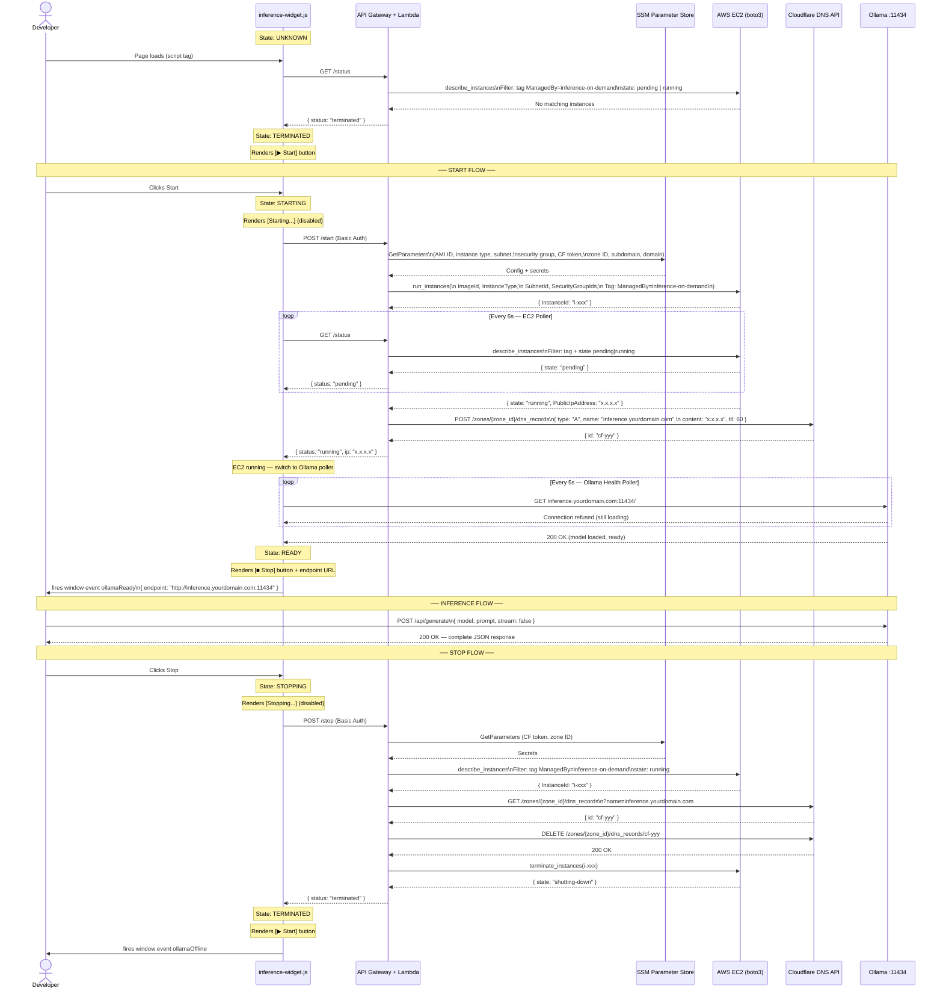

# Sequence Diagram — End-to-End User Interaction & State Transitions

## Notes

- **Tag-based lookup** — EC2 instances are tagged `ManagedBy=inference-on-demand` at launch. `stop.py` and `status.py` always query by tag — no instance ID stored in SSM.
- **Cloudflare record lookup on stop** — `stop.py` queries Cloudflare by subdomain name to get the record ID — no record ID stored in SSM.
- **Two-stage polling** — EC2 Poller waits for `running` state. Ollama Health Poller then waits for 200 OK directly on `:11434`. ~30–60s gap between the two while the model loads.
- **DNS propagation** — Cloudflare A record is created once EC2 is `running`. TTL 60s. The Ollama Health Poller absorbs the propagation gap naturally.
- **Stop is fast** — `DELETE` on Cloudflare API + `terminate_instances` via boto3 completes in ~10–30 seconds.
- **Inference is direct** — Developer calls `inference.yourdomain.com:11434` directly. Lambda is never in the inference path.
- **Page reload resilience** — Widget calls `GET /status` on load. `status.py` queries EC2 by tag — if an instance is running, widget recovers to STARTING or READY without a new launch.