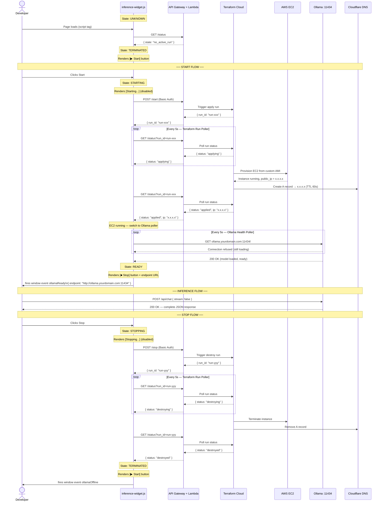

# Sequence Diagram — End-to-End User Interaction & State Transitions

## Notes

- **Two-stage polling during start:** The widget first polls Terraform Cloud (via `/status`) to wait for EC2 to reach `running`, then switches to polling Ollama directly on `:11434`. These are separate checks — EC2 running does not mean Ollama is ready.
- **Inference is always direct:** The Developer's inference calls go straight to `ollama.yourdomain.com:11434` — Lambda and API Gateway are never in the inference path.
- **DNS propagation gap:** After Terraform creates the Cloudflare A record, there is a ~60 second TTL window before the subdomain resolves. The Ollama Health Poller handles this naturally — it keeps retrying until it gets a 200 OK regardless of the reason for failure.
- **Stop is terminal:** EC2 is terminated (not stopped). The next Start provisions a fresh instance from the AMI with a new public IP. Terraform Cloud updates the Cloudflare A record accordingly.
- **Page reload resilience:** If the developer reloads the page mid-session, the widget calls `GET /status` on load and can recover state from the Terraform Cloud run status.