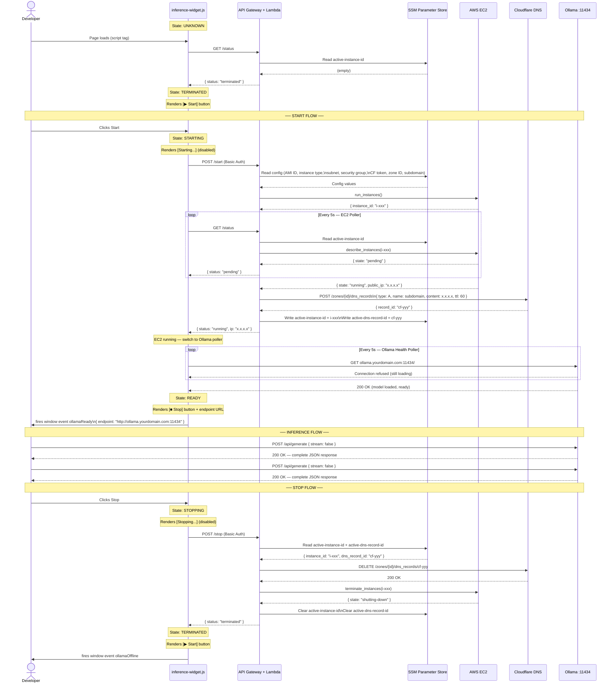

# Sequence Diagram — End-to-End User Interaction & State Transitions

## Notes

- **Two-stage polling during start:** The widget first polls `GET /status` (EC2 state via `describe_instances`) until EC2 is `running`, then switches to polling Ollama directly on `:11434`. These are separate checks — EC2 `running` does not mean Ollama is ready to serve.
- **Inference is always direct:** The Developer's inference calls go straight to `ollama.yourdomain.com:11434` — Lambda and API Gateway are never in the inference path.
- **DNS propagation gap:** After `start.py` creates the Cloudflare A record, there is a ~60 second TTL window before the subdomain resolves. The Ollama Health Poller handles this naturally — it retries on any failure regardless of the reason.
- **Stop is fast:** Deleting a DNS record and terminating an EC2 instance via direct API calls completes in ~10-30 seconds.
- **SSM as state store:** `start.py` writes `instance_id` and `dns_record_id` to SSM immediately after provisioning. `stop.py` reads these to know what to tear down. `status.py` reads `instance_id` to know whether an active session exists.
- **Page reload resilience:** If the developer reloads the page mid-session, the widget calls `GET /status` on load. `status.py` reads `instance_id` from SSM and calls `describe_instances` — if the instance is running, the widget recovers to STARTING or READY without requiring a new launch.