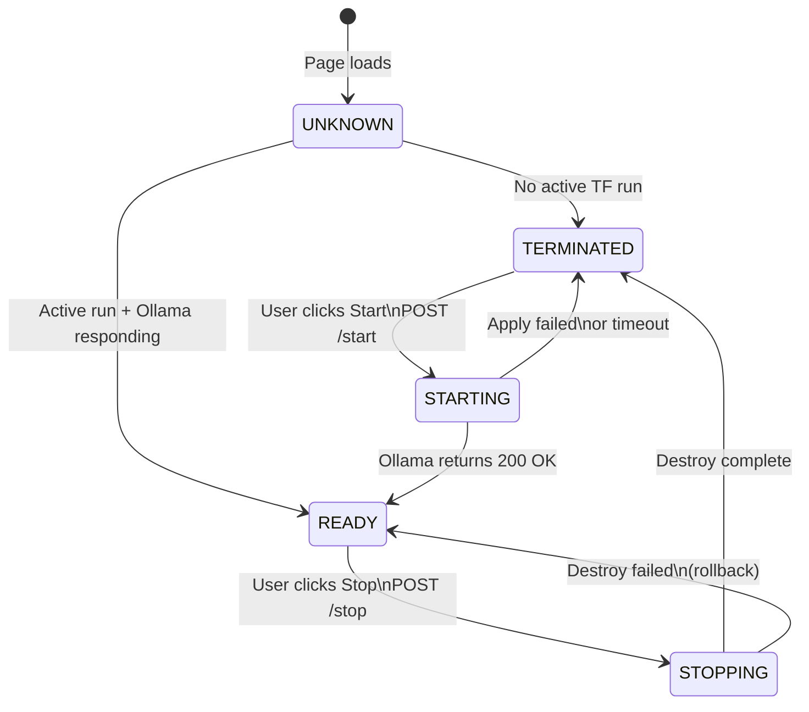

# State Diagram — inference-widget.js

## Notes

- **UNKNOWN** is transient — the widget resolves it immediately on load by calling `GET /status`
- **STARTING** spans two polling phases: Terraform apply → EC2 running, then Ollama health check → 200 OK
- **STOPPING** polls Terraform destroy run until completion
- Error transitions return to the last stable state — apply failure goes back to TERMINATED, destroy failure goes back to READY
